<div align="center">

</div>

<br>

<p align="center"><picture align="center"></picture></p>
<h1 align="center">Hi 👋, I'm Sanara Perera</h1>
<h3 align="center">Passionate IT Student | Exploring the Boundless World of Technology</h3>
<p align="center">  </p>

---

<br>

- 🔭  I'm building front-end, web apps, and small tools
  
- 🧑‍🎓 I'm a Computer Science Undergraduate at IIT
  
- 🌱 I’m currently learning OOP with java
  
- 👨‍💻 All of my projects are Below

- 💬 Ask me about python

- ⚡ My linkedin **https://www.linkedin.com/in/sanaraperera/**
  
- 📫 How to reach me **sanaraperera2003@gmail.com**

<br><br><br><br>

<h3 align="center">📊 MY STATISTICS 📊</h3>
<p align="center">
<a href="https://github.com/AVS1508">
  
  
</a>
</p>

<h2 align="center">📈 CONTRIBUTION GRAPH 📈</h2>
<div align="center">


</div>

---


## `> ls -la /skills`

<div align="center">

### Languages


### Frameworks & Tools


</div>

---


## `> Connect With Me`

<div align="center">

[](https://linkedin.com/in/sanaraperera)
[](https://github.com/Sanara-Perera)
[](mailto:sanaraperera2003@gmail.com)

</div>

---

<div align="center">

```
╔══════════════════════════════════════════════╗
║   Built with curiosity · Powered by coffee   ║
╚══════════════════════════════════════════════╝
```


</div>


